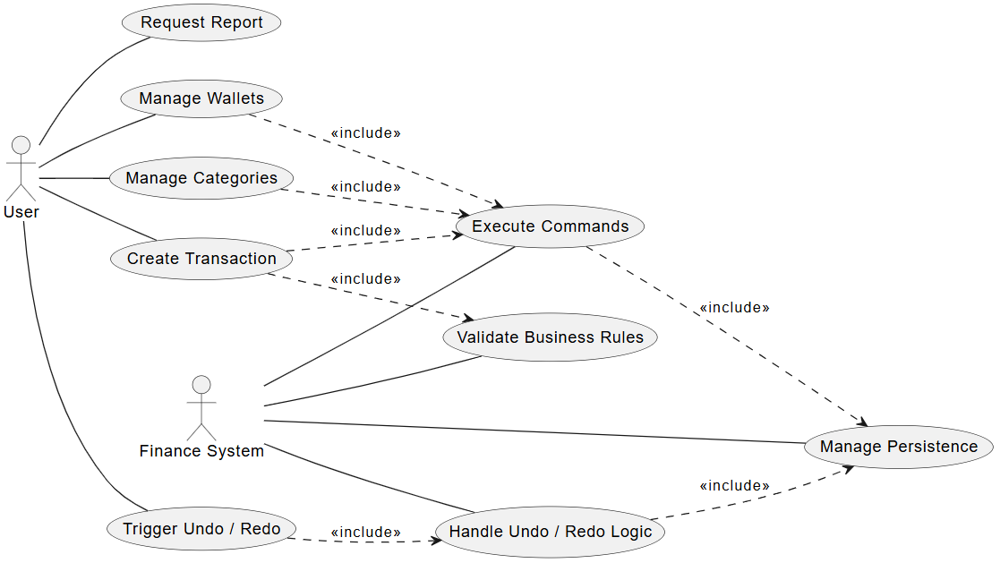
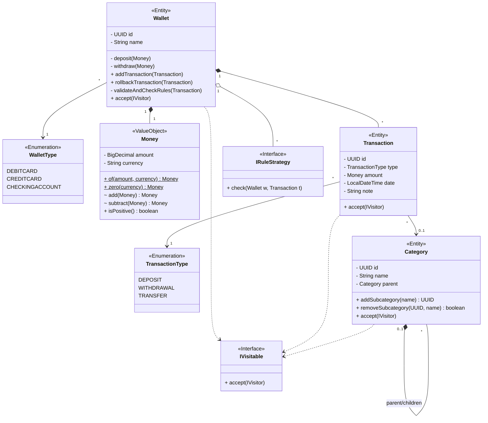
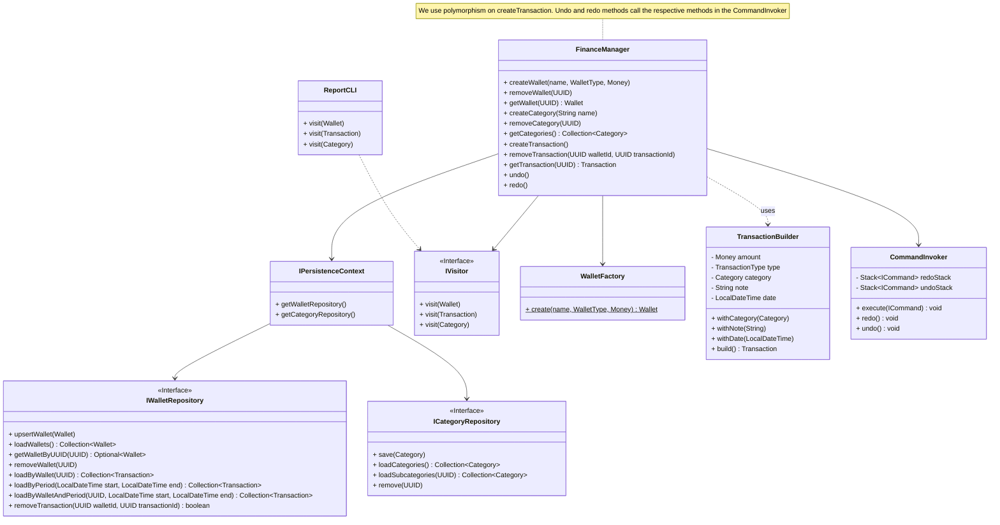
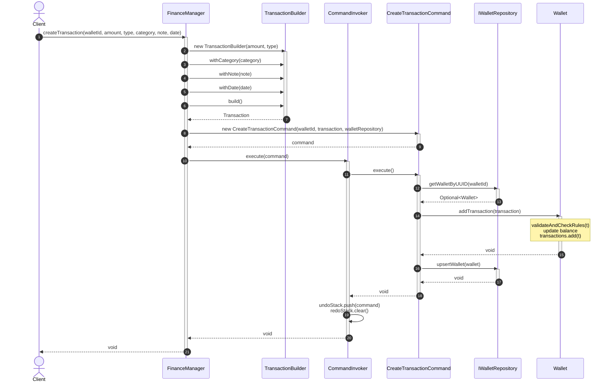
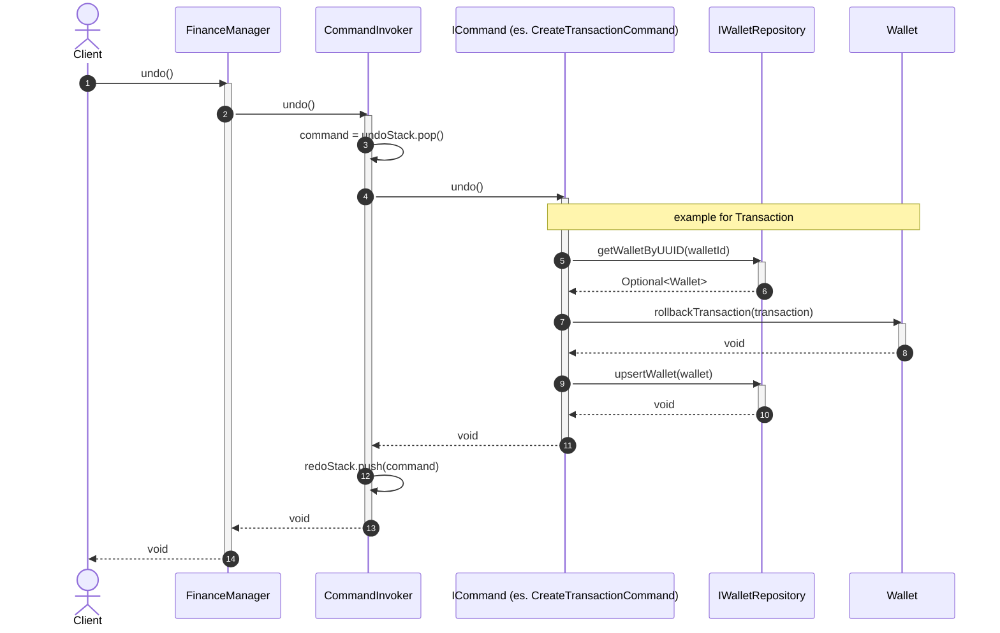
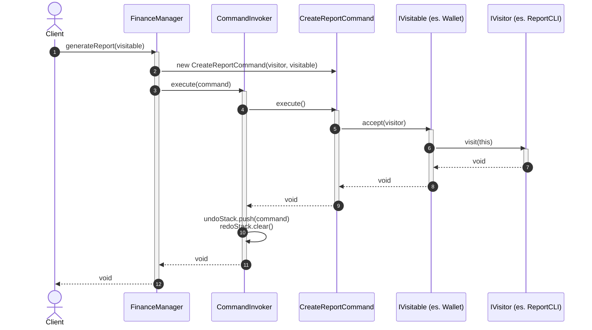
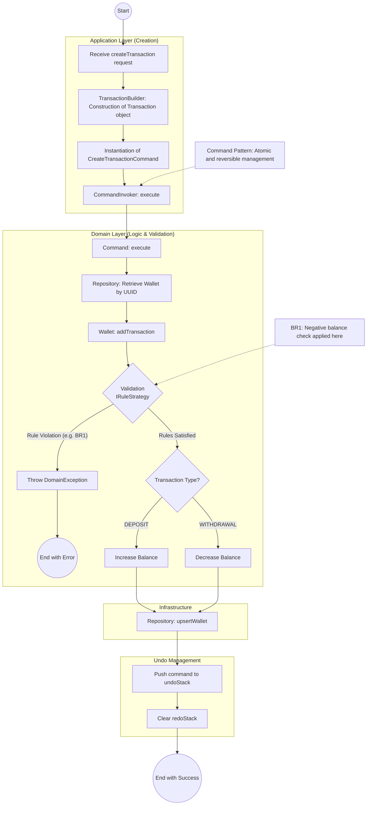

<!-- TOC -->
* [java-clean-finance](#java-clean-finance)
  * [Project Overview](#project-overview)
* [Requirements](#requirements)
  * [1. Functional Requirements (FR)](#1-functional-requirements-fr)
  * [2. Non-Functional Requirements (NFR)](#2-non-functional-requirements-nfr)
  * [3. Business Rules (BR)](#3-business-rules-br)
* [Architectural Philosophy](#architectural-philosophy)
* [Design](#design)
  * [Core Design Patterns](#core-design-patterns)
    * [1. Command Pattern: Decoupling & Transactional Integrity](#1-command-pattern-decoupling--transactional-integrity)
    * [2. Strategy Pattern: Dynamic Business Rules](#2-strategy-pattern-dynamic-business-rules)
    * [3. Visitor Pattern: Separation of Concerns in Hierarchies](#3-visitor-pattern-separation-of-concerns-in-hierarchies)
    * [4. Composite Pattern: Category Management](#4-composite-pattern-category-management)
* [Diagrams](#diagrams)
  * [Use Case](#use-case)
  * [Model](#model)
  * [Command](#command)
  * [Manager](#manager)
  * [Sequence of action which occurs while creating a transaction](#sequence-of-action-which-occurs-while-creating-a-transaction)
  * [Sequence of action which occurs with undo](#sequence-of-action-which-occurs-with-undo)
  * [Sequence of actions which occurs with generateReport](#sequence-of-actions-which-occurs-with-generatereport)
  * [Activity diagram of createTransaction](#activity-diagram-of-createtransaction)
* [Note](#note)
<!-- TOC -->

# java-clean-finance
A reference implementation of a Personal Finance System, engineered with a strict adherence to Clean Architecture and Domain-Driven Design (DDD) principles.
This project serves as a showcase for decoupling business logic from infrastructure, ensuring maintainability, testability, and architectural evolution.

## Project Overview
The objective of java-clean-finance is to manage financial lifecycles across heterogeneous wallet types and transaction modalities.
Unlike traditional CRUD applications, this system enforces complex domain invariants and business rules at the core level, remaining entirely agnostic of the persistence layer or UI framework.

# Requirements

## 1. Functional Requirements (FR)
Functional requirements define the core operational capabilities of the system.

| ID      | Requirement                      | Description                                                                                                                                                                                        |
|:--------|:---------------------------------|:---------------------------------------------------------------------------------------------------------------------------------------------------------------------------------------------------|
| **FR1** | **Multi-type Wallet Management** | The system must support various wallet types (e.g., *Debit Card*, *Credit Card*, *Checking Account*), each with specific behavioral constraints during debit operations.                           |
| **FR2** | **Transactional Engine**         | Native support for *Deposit*, *Withdrawal*, and *Transfer* operations. Transfers must be atomic: a failure in the deposit phase must trigger a rollback of the withdrawal to maintain consistency. |
| **FR3** | **Category Hierarchy**           | Organization of expenses via a tree structure (Composite Pattern). Every transaction must be associated with a category or subcategory (e.g., *Food -> Supermarket*).                              |
| **FR4** | **History and Reversibility**    | Implementation of a full *Undo/Redo* mechanism for every operation that modifies the domain state, such as transaction creation or wallet removal.                                                 |
| **FR5** | **Extensible Reporting**         | Generation of financial reports (e.g., CLI or export) while isolating the reporting logic from the core domain entities using the Visitor Pattern.                                                 |

## 2. Non-Functional Requirements (NFR)
Non-functional requirements define the technical constraints and quality attributes necessary for Clean Architecture compliance.

* **NFR1: Financial Precision:** The system must not use floating-point types for monetary calculations. It is mandatory to use `BigDecimal` with `HALF_EVEN` rounding to prevent approximation errors.
* **NFR2: Agnostic Persistence:** The system must support switching between different storage engines (e.g., MariaDB, In-Memory) without modifying the Use Case or Domain logic.
* **NFR3: Domain Extensibility:** Adding new business rules (e.g., daily spending limits) must be achieved by injecting new validation strategies without modifying the existing `Wallet` entity code (Open/Closed Principle).

## 3. Business Rules (BR)
These rules represent the domain invariants that the software must strictly enforce:

* **BR1 (No Negative Balance):** A `DEBITCARD` wallet can never have a negative balance. Any transaction violating this rule must throw a `DomainException` and halt execution.
* **BR2 (Currency Consistency):** Operations (addition, subtraction, transfer) between `Money` objects with different currencies are prohibited without an explicit exchange rate converter.
* **BR3 (Mandatory Categorization):** Every transaction must be linked to at least one root category for classification and reporting purposes.

Here is given an example of category and subcategory:

|  Category  | Subcategory  |
|:----------:|:------------:|
| University |    Taxes     |
|            |    Books     |
| Transport  |     Bus      |
|            |     Fuel     |
|            |     RCA      |
|    Food    | Lunch&Dinner |
|            | Supermarket  |
|  Fitness   |    Sport     |
|            |     Gym      |
|            |     Pool     |

# Architectural Philosophy
This system is built upon the **Hexagonal (Ports & Adapters)** pattern.
The dependency rule is absolute: dependencies only point inwards toward the Domain Layer.

* **Domain Layer**: Contains Entities (Wallet, Transaction), Value Objects (Money) and Domain Exceptions.
* **Application Layer**: Orchestrates the flow of data via the Command Pattern and defines Interfaces (Ports) for external communication.
* **Infrastructure Layer**: Implements the Ports (Adapters) for different databases and external frameworks.

# Design
To address the rigorous requirements of financial software, the following GoF (Gang of Four) patterns were strategically implemented:

|  Pattern  |  Category  |                           Motivation                            |
|:---------:|:----------:|:---------------------------------------------------------------:|
|  Command  | Behavioral |      To enable Undo/Redo actions and decouple operations.       |
| Strategy  | Behavioral | To dynamically apply different business constraints to wallets. |
|  Visitor  | Behavioral | To separate algorithms from the object structures they work on. |
|  Factory  | Creational |   To standardize the creation of wallets with specific rules.   |
|  Builder  | Creational |   To handle the complex construction of transaction entities.   |
| Composite | Structural |              To handle Category and Subcategories               |

A critical design decision was the implementation of the Money Value Object.
By using BigDecimal with explicit rounding modes and currency validation, the system eliminates the precision errors and "currency-mixing" bugs common in financial systems using floating-point primitives.

## Core Design Patterns

### 1. Command Pattern: Decoupling & Transactional Integrity
The **Command Pattern** is the backbone of the application's operations. Beyond simple execution, it provides:
* **Undo/Redo Functionality:** By encapsulating operations into objects, the system maintains an execution history for seamless state reversal.

### 2. Strategy Pattern: Dynamic Business Rules
Wallet validation logic (e.g., checking for insufficient funds or withdrawal limits) is delegated to an interchangeable family of algorithms via the **Strategy Pattern**.
* **Compliance:** Different wallet types (Debit vs. Credit) can have different `IRuleStrategy` implementations.
* **Open/Closed Principle:** New financial constraints can be added at runtime by injecting new strategies without modifying the existing `Wallet` entity code.

### 3. Visitor Pattern: Separation of Concerns in Hierarchies
The system utilizes the **Visitor Pattern** to navigate the complex tree structures of `Category` and `Wallet` objects.
* **Extensibility:** It allows adding new operations—such as generating financial reports, exporting data to JSON without polluting the domain model with infrastructure-specific logic.

### 4. Composite Pattern: Category Management
The hierarchical relationship between **Categories** and **Subcategories** is managed through the **Composite Pattern**. This treats individual categories and groups of categories uniformly, enabling nesting as required by the user's personal finance organization.

# Diagrams
## Use Case

## Model

## Command

```mermaid
classDiagram
    class CreateCategoryCommand {
        - ICategoryRepository categoryRepository
        - Category category
        + execute() void
        + undo() void
    }
    class CreateReportCommand {
        - IVisitable visitable
        - IVisitor visitor
        + execute() void
        + undo() void
    }
    class CreateTransactionCommand {
        - UUID walletId
        - IWalletRepository walletRepository
        - Transaction transaction
        + execute() void
        + undo() void
    }
    class ICommand {
        <<Interface>>
        + undo() void
        + execute() void
    }
    class RemoveCategoryCommand {
        - Category category
        - ICategoryRepository categoryRepository
        + undo() void
        + execute() void
    }
    class RemoveTransactionCommand {
        - UUID walletId
        - Transaction transaction
        - IWalletRepository walletRepository
        + execute() void
        + undo() void
    }
    class RemoveWalletCommand {
        - IWalletRepository walletRepository
        - Wallet wallet
        - UUID id
        + execute() void
        + undo() void
    }
    class SaveWalletCommand {
        - Wallet wallet
        - IWalletRepository walletRepository
        + getWallet() Wallet
        + undo() void
        + execute() void
    }
    
    CreateCategoryCommand  ..>  ICommand
    CreateReportCommand  ..>  ICommand
    CreateTransactionCommand  ..>  ICommand
    RemoveCategoryCommand  ..>  ICommand
    RemoveTransactionCommand  ..>  ICommand
    RemoveWalletCommand  ..>  ICommand
    SaveWalletCommand  ..>  ICommand
```

## Manager

## Sequence of action which occurs while creating a transaction
The following sequence diagram illustrates the detailed interactions between the system's components during the execution of a transaction creation request, adhering to the Clean Architecture layers:

* **Request Orchestration and Object Construction**: The process is initiated by the `FinanceManager`, which receives the client's request and utilizes the `TransactionBuilder` to construct a new `Transaction` entity. The builder provides a fluent interface to set optional parameters like categories, notes, and dates while ensuring mandatory fields are present.
* **Command Lifecycle Management**: Once the entity is built, the `FinanceManager` instantiates a `CreateTransactionCommand`, injecting the target `walletId`, the `Transaction` object, and the `IWalletRepository` port. The command is then passed to the `CommandInvoker` for execution.
* **Domain Interaction and Validation**: During execution, the command retrieves the `Wallet` aggregate root from the repository. The `Wallet.addTransaction()` method is invoked, which internally performs business rule validation via the Strategy pattern and updates the wallet's balance based on the transaction type (DEPOSIT, WITHDRAWAL, or TRANSFER).
* **Persistence and State Tracking**: After the domain logic is successfully applied, the command persists the updated state of the `Wallet` aggregate through the `upsertWallet` method of the repository. Finally, the `CommandInvoker` registers the operation by pushing the command onto the `undoStack` and clearing the `redoStack`, ensuring the operation can be reversed in compliance with requirement FR4.

## Sequence of action which occurs with undo

## Sequence of actions which occurs with generateReport

## Activity diagram of createTransaction
The following activity diagram illustrates the behavioral view of the transaction creation process, highlighting the separation of concerns between the architectural layers:

* **Application Layer Orchestration**: The process begins in the `FinanceManager`, which utilizes a `TransactionBuilder` to ensure a valid and consistent construction of the `Transaction` entity. The operation is then encapsulated within a `CreateTransactionCommand` to support the Command Pattern requirements for decoupling and reversibility.
* **Domain Logic and Business Rules**: Once the `CommandInvoker` triggers the execution, the control shifts to the Domain Layer. The `Wallet` entity performs a critical validation step by iterating through its collection of `IRuleStrategy` implementations. This ensures that domain invariants, such as the "No Negative Balance" rule (BR1), are strictly enforced before any state transition occurs.
* **State Transition and Persistence**: If all business rules are satisfied, the `Wallet` updates its internal balance and transaction history. The infrastructure layer then persists the updated aggregate through the `IWalletRepository` implementation.
* **Transactional Integrity and Reversibility**: Upon successful execution, the command is pushed onto the `undoStack` of the `CommandInvoker`. This mechanism fulfills the functional requirement for full system reversibility (FR4), allowing the user to rollback the operation to a previous consistent state if necessary, ensuring the overall integrity of the financial data.

# Note
The project implementation focuses on demonstrating Clean Architecture principles and is not intended for production use.
Consequently, the persistence layer is not implemented, and end-to-end database connectivity has not been established.
