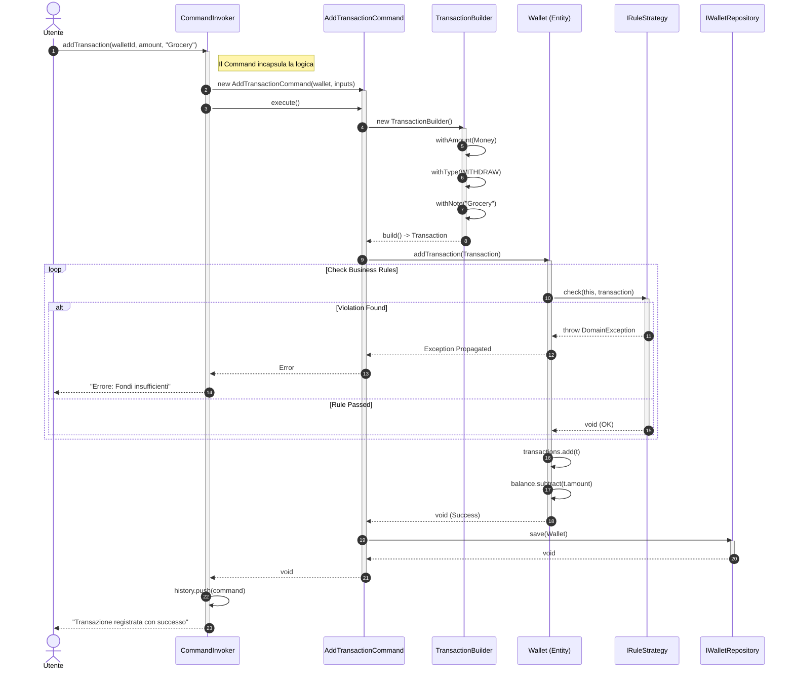
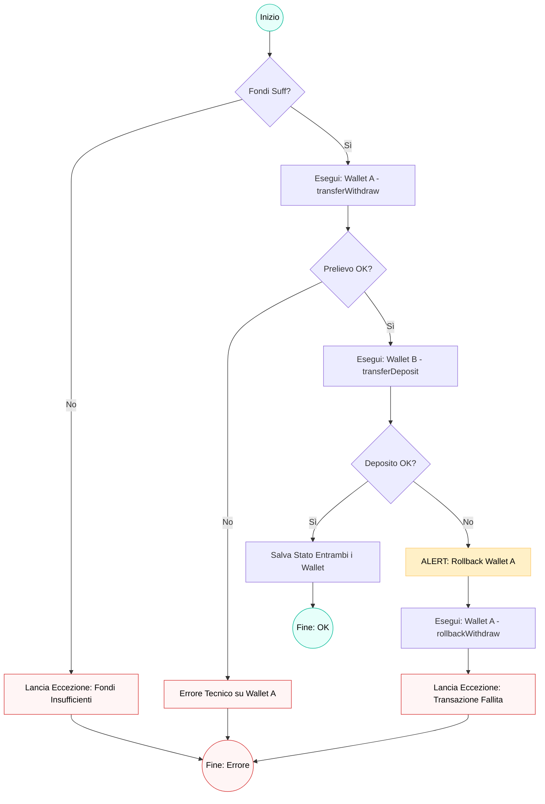

# java-clean-finance
A reference implementation of a Personal Finance System in Java.

# Requirements
The software must **handle different wallet** *(CREDITCARD, DEBITCARD, CHECKINGCURRENT, ...)* and **different transactions** *(DEPOSIT, WITHDRAWN and TRANSFER)* with those wallets.

The software must **execute only allowed operation**: for example, a DEBITCARD can't have a negative amount of money

Each transaction must **have a category**, each category can have *subcategory*.

The software, due to internal need, must **allow connection and data saving to different type of Database**.

The software must **allow undo/redo operations**.

Here is given an exampe of category and subcategory, which must be **editable at runtime**:

|  Category  |  Subcategory  |
|:----------:|:-------------:|
| University |     Taxes     |
|            |     Books     |
| Transport  |      Bus      |
|            |     Fuel      |
|            |      RCA      |
|    Food    | Launch&Dinner |
|            |  Supermarket  |
|  Fitness   |     Sport     |
|            |      Gym      |
|            |     Pool      |

# Design
In order to meet the requirements I decide to use different design patterns:

|  Pattern  |  Category  |                           Motivation                            |
|:---------:|:----------:|:---------------------------------------------------------------:|
|  Command  | Behavioral |      To enable Undo/Redo actions and decouple operations.       |
| Strategy  | Behavioral | To dynamically apply different business constraints to wallets. |
|  Visitor  | Behavioral | To separate algorithms from the object structures they work on. |
|  Factory  | Creational |   To standardize the creation of wallets with specific rules.   |
|  Builder  | Creational |   To handle the complex construction of transaction entities.   |
| Composite | Structural |              To handle Category and Subcategories               |

## Architectural Rationale & Design Decisions

The architecture of **java-clean-finance** is engineered following **Clean Architecture** principles. The primary objective is to decouple the core business logic from external infrastructure and frameworks, ensuring the system remains maintainable, testable, and agnostic to database implementation details.

### Core Design Patterns

To address the rigorous requirements of a financial system, several GoF (Gang of Four) design patterns were strategically integrated:

#### 1. Command Pattern: Decoupling & Transactional Integrity
The **Command Pattern** is the backbone of the application's operations. Beyond simple execution, it provides:
* **Undo/Redo Functionality:** By encapsulating operations (e.g., `AddTransactionCommand`, `MakeTransferCommand`) into objects, the system maintains an execution history for seamless state reversal.
* **Atomicity:** Complex operations like transfers between wallets are handled within a single command context, ensuring that a failure in one step (e.g., deposit) triggers a rollback or prevents the initial step (e.g., withdrawal), maintaining financial consistency.

#### 2. Strategy Pattern: Dynamic Business Rules
Wallet validation logic (e.g., checking for insufficient funds or withdrawal limits) is delegated to an interchangeable family of algorithms via the **Strategy Pattern**.
* **Compliance:** Different wallet types (Debit vs. Credit) can have different `IRuleStrategy` implementations.
* **Open/Closed Principle:** New financial constraints can be added at runtime by injecting new strategies without modifying the existing `Wallet` entity code.

#### 3. Visitor Pattern: Separation of Concerns in Hierarchies
The system utilizes the **Visitor Pattern** to navigate the complex tree structures of `Category` and `Wallet` objects.
* **Extensibility:** It allows adding new operations—such as generating financial reports, exporting data to JSON, or rendering UI TreeItems—without polluting the domain model with infrastructure-specific logic.

#### 4. Composite Pattern: Category Management
The hierarchical relationship between **Categories** and **Subcategories** is managed through the **Composite Pattern**. This treats individual categories and groups of categories uniformly, enabling infinite nesting as required by the user's personal finance organization.

#### 5. Domain Robustness: Value Objects
To prevent precision errors and side effects common in financial software, monetary values are implemented as **Value Objects** (`Money`). This ensures immutability and encapsulates all currency-related logic (e.g., mismatched currency exceptions), guaranteeing that the domain state remains valid at all times.

# Diagrams
Here are some UML diagrams to understand the project:

## Class Diagram
This is the project structure:

```mermaid
classDiagram
%% =========================================================
%% 1. CORE DOMAIN (Models & Values)
%% =========================================================

    class Money {
        <<ValueObject>>
        -BigDecimal amount
        -String currency
        +of(amount, currency) Money$
        +add(Money) Money
        +subtract(Money) Money
        +isPositive() boolean
        +isNegative() boolean
    }

    class Wallet {
        <<Entity>>
        -UUID id
        -String name
        -WalletType type
        -Money balance
        -Collection~IRuleStrategy~ ruleStrategies
        -Collection~Transaction~ transactions
        +addTransaction(Transaction)
        +removeTransaction(Transaction)
        +transferWithdraw(Transaction)
        +transferDeposit(Transaction)
        +rollbackDeposit(Transaction)
        +rollbackWithdraw(Transaction)
        +accept(IVisitor)
    }

    class Transaction {
        <<Entity>>
        -UUID id
        -Money money
        -TransactionType type
        -LocalDateTime date
        -String note
        +accept(IVisitor)
    }

    class Category {
        <<Entity>>
        -UUID id
        -String name
        -Category parent
        -Collection~Category~ children
        +add(Category)
        +remove(Category)
        +accept(IVisitor)
    }

    class WalletType {
        <<Enumeration>>
        DEBITCARD
        CREDITCARD
        CHECKINGACCOUNT
    }

    class TransactionType {
        <<Enumeration>>
        DEPOSIT
        WITHDRAW
        TRANSFER
    }

%% Relazioni Core
    Wallet *-- Money
    Wallet o-- Transaction : contains
    Wallet --> WalletType
    Wallet ..|> IVisitable

    Transaction *-- Money
    Transaction --> TransactionType
    Transaction --> Category
    Transaction ..|> IVisitable

    Category o-- Category : parent/children
    Category ..|> IVisitable

%% =========================================================
%% 2. STRATEGY PATTERN (Business Rules)
%% =========================================================

    class IRuleStrategy {
        <<Interface>>
        +check(Wallet w, Transaction t)
    }

    class MaxWithdraw {
        -double maxAmount
        +check(Wallet w, Transaction t)
    }

    class NegativeBalanceNotAllowed {
        +check(Wallet w, Transaction t)
    }

    Wallet o-- IRuleStrategy
    MaxWithdraw ..|> IRuleStrategy
    NegativeBalanceNotAllowed ..|> IRuleStrategy

%% =========================================================
%% 3. FACTORY & BUILDER
%% =========================================================

    class WalletFactory {
        +create(name, WalletType, initialBalance) Wallet$
    }

    class TransactionBuilder {
        -Money amount
        -TransactionType type
        -Category category
        +withCategory(Category)
        +withNote(String)
        +withDate(LocalDateTime)
        +build() Transaction
    }

    WalletFactory ..> Wallet : creates
    TransactionBuilder ..> Transaction : builds

%% =========================================================
%% 4. APPLICATION LAYER (Manager & Commands)
%% =========================================================

    class FinanceManager {
        -IWalletRepository walletRepository
        -ICategoryRepository categoryRepository
        -WalletFactory walletFactory
        +addWallet(Wallet)
        +removeWallet(UUID)
        +addCategory(Category)
        +getWallet(UUID)
    }

    class CommandInvoker {
        -Stack~ICommand~ commandHistory
        -Stack~ICommand~ redoStack
        +createWallet(FinanceManager, Wallet)
        +addTransaction(Wallet, Transaction)
        +transfer(Wallet from, Wallet to, Transaction)
        +createCategory(FinanceManager, Category)
        +undo()
        +redo()
    }

    class ICommand {
        <<Interface>>
        +execute()
        +undo()
    }

    class AddTransactionCommand {
        -Wallet wallet
        -Transaction transaction
        +execute()
        +undo()
    }

    class MakeTransferCommand {
        -Wallet walletForWithdraw
        -Wallet walletForDeposit
        -Transaction transaction
        +execute()
        +undo()
    }

    class NewWalletCommand {
        -FinanceManager financeManager
        -Wallet wallet
        +execute()
        +undo()
    }

    class NewCategoryCommand {
        -FinanceManager financeManager
        -Category category
        +execute()
        +undo()
    }

%% Relazioni Command
    CommandInvoker o-- ICommand
    AddTransactionCommand ..|> ICommand
    MakeTransferCommand ..|> ICommand
    NewWalletCommand ..|> ICommand
    NewCategoryCommand ..|> ICommand

%% Command Dependencies (Receivers)
    AddTransactionCommand --> Wallet : receiver
    MakeTransferCommand --> Wallet : receiver
    NewWalletCommand --> FinanceManager : receiver
    NewCategoryCommand --> FinanceManager : receiver

%% =========================================================
%% 5. PORTS & ADAPTERS (Repository & Persistence)
%% =========================================================

    class IWalletRepository {
        <<Interface>>
        +save(Wallet)
        +findById(UUID)
        +removeWallet(UUID)
        +update(Wallet)
    }

    class ICategoryRepository {
        <<Interface>>
        +save(Category)
        +delete(Category)
        +findById(UUID)
        +findByName(String)
    }

    class MariaDBWalletPersistence {
        -EntityManagerFactory emf
    }

    class MariaDBCategoryPersistence {
        -EntityManagerFactory emf
    }

    FinanceManager --> IWalletRepository
    FinanceManager --> ICategoryRepository
    MariaDBWalletPersistence ..|> IWalletRepository
    MariaDBCategoryPersistence ..|> ICategoryRepository

%% =========================================================
%% 6. VISITOR PATTERN
%% =========================================================

    class IVisitor {
        <<Interface>>
        +visit(Wallet)
        +visit(Transaction)
        +visit(Category)
    }

    class IVisitable {
        <<Interface>>
        +accept(IVisitor)
    }
```

## Sequence Diagram
This is the sequence of action that occurs while creating a transaction

## Activity Diagram
This are the actions which occurs while making a trasfer

