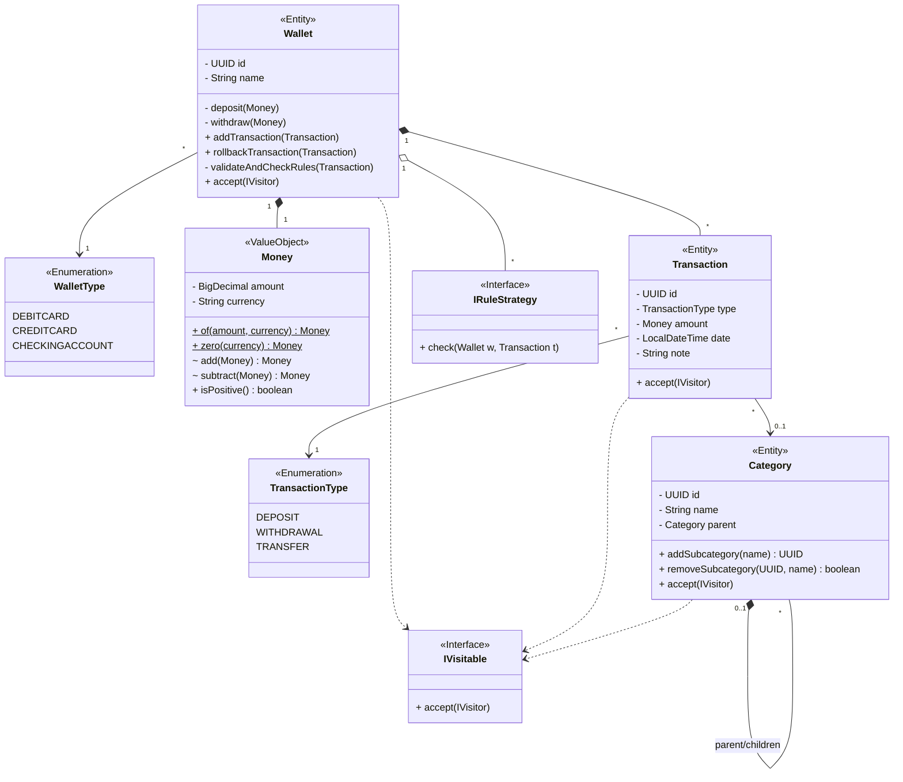
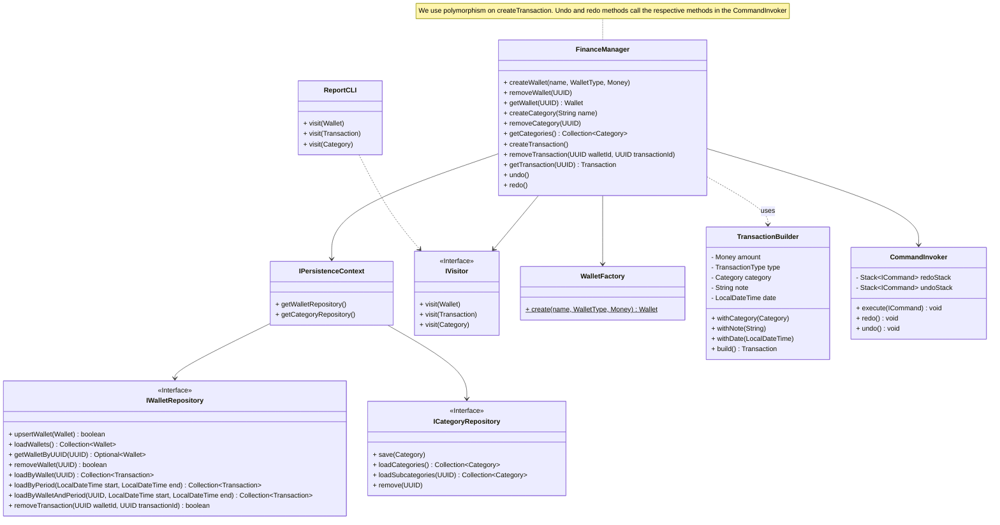

# Model:

```mermaid
classDiagram
    class Wallet{
    <<Entity>>
    - UUID id
    - String name
    - deposit(Money)
    - withdraw(Money)
    + addTransaction(Transaction)
    + rollbackTransaction(Transaction)
    - validateAndCheckRules(Transaction)
    + accept(IVisitor)
    }

    class WalletType {
        <<Enumeration>>
        DEBITCARD
        CREDITCARD
        CHECKINGACCOUNT
    }

    class Money {
        <<ValueObject>>
        - BigDecimal amount
        - String currency
        + of(amount, currency) Money $
        + zero(currency) Money $
        ~ add(Money) Money
        ~ subtract(Money) Money
        + isPositive() boolean
    }

    class Transaction {
        <<Entity>>
        - UUID id
        - TransactionType type
        - Money amount
        - LocalDateTime date
        - String note
        + accept(IVisitor)
    }
    
    class TransactionType {
        <<Enumeration>>
        DEPOSIT
        WITHDRAWAL
        TRANSFER
    }

    class Category {
        <<Entity>>
        - UUID id
        - String name
        - Category parent
        + addSubcategory(name) UUID
        + removeSubcategory(UUID, name) boolean
        + accept(IVisitor)
    }

    class IRuleStrategy {
        <<Interface>>
        + check(Wallet w, Transaction t)
    }

    Wallet "*" --> "1" WalletType
    Wallet "1" *-- "1" Money
    Wallet "1" *-- "*" Transaction
    Wallet "1" o-- "*" IRuleStrategy
    Wallet ..> IVisitable

    Transaction "*" --> "0..1" Category
    Transaction "*" --> "1" TransactionType
    Transaction ..> IVisitable

    Category "0..1" *-- "*" Category : parent/children
    Category ..> IVisitable

    %% =======================================
    %% Visitor
    %% =======================================

    class IVisitable {
        <<Interface>>
        + accept(IVisitor)
    }

```

# Command:

```mermaid
classDiagram
    class CreateCategoryCommand {
        - ICategoryRepository categoryRepository
        - Category category
        + execute() void
        + undo() void
    }
    class CreateReportCommand {
        - IVisitable visitable
        - IVisitor visitor
        + execute() void
        + undo() void
    }
    class CreateTransactionCommand {
        - UUID walletId
        - IWalletRepository walletRepository
        - Transaction transaction
        + execute() void
        + undo() void
    }
    class ICommand {
        <<Interface>>
        + undo() void
        + execute() void
    }
    class RemoveCategoryCommand {
        - Category category
        - ICategoryRepository categoryRepository
        + undo() void
        + execute() void
    }
    class RemoveTransactionCommand {
        - UUID walletId
        - Transaction transaction
        - IWalletRepository walletRepository
        + execute() void
        + undo() void
    }
    class RemoveWalletCommand {
        - IWalletRepository walletRepository
        - Wallet wallet
        - UUID id
        + execute() void
        + undo() void
    }
    class SaveWalletCommand {
        - Wallet wallet
        - IWalletRepository walletRepository
        + getWallet() Wallet
        + undo() void
        + execute() void
    }
    
    CreateCategoryCommand  ..>  ICommand
    CreateReportCommand  ..>  ICommand
    CreateTransactionCommand  ..>  ICommand
    RemoveCategoryCommand  ..>  ICommand
    RemoveTransactionCommand  ..>  ICommand
    RemoveWalletCommand  ..>  ICommand
    SaveWalletCommand  ..>  ICommand
```

# Manager:

```mermaid
classDiagram
    class IPersistenceContext{
        + getWalletRepository()
        + getCategoryRepository()
    }

    class IWalletRepository{
        <<Interface>>
        + upsertWallet(Wallet) boolean
        + loadWallets() Collection~Wallet~
        + getWalletByUUID(UUID) Optional~Wallet~
        + removeWallet(UUID) boolean
        + loadByWallet(UUID) Collection~Transaction~
        + loadByPeriod(LocalDateTime start, LocalDateTime end) Collection~Transaction~
        + loadByWalletAndPeriod(UUID, LocalDateTime start, LocalDateTime end) Collection~Transaction~
        + removeTransaction(UUID walletId, UUID transactionId) boolean
    }

    class ICategoryRepository{
        <<Interface>>
        + save(Category)
        + loadCategories() Collection~Category~
        + loadSubcategories(UUID) Collection~Category~
        + remove(UUID)
    }

    IPersistenceContext --> IWalletRepository
    IPersistenceContext --> ICategoryRepository

    class IVisitor {
        <<Interface>>
        + visit(Wallet)
        + visit(Transaction)
        + visit(Category)
    }
    class ReportCLI{
        + visit(Wallet)
        + visit(Transaction)
        + visit(Category)
    }

    ReportCLI ..> IVisitor
    
    class FinanceManager {
        + createWallet(name, WalletType, Money)
        + removeWallet(UUID)
        + getWallet(UUID) Wallet
        + createCategory(String name)
        + removeCategory(UUID)
        + getCategories() Collection~Category~
        + createTransaction()
        + removeTransaction(UUID walletId, UUID transactionId)
        + getTransaction(UUID) Transaction
        + undo()
        + redo()
    }

    note for FinanceManager "We use polymorphism on createTransaction. Undo and redo methods call the respective methods in the CommandInvoker"

    class WalletFactory {
        + create(name, WalletType, Money) Wallet$
    }

    class TransactionBuilder {
        - Money amount
        - TransactionType type
        - Category category
        - String note
        - LocalDateTime date
        + withCategory(Category)
        + withNote(String)
        + withDate(LocalDateTime)
        + build() Transaction
    }

    class CommandInvoker {
        - Stack~ICommand~ redoStack
        - Stack~ICommand~ undoStack
        + execute(ICommand) void
        + redo() void
        + undo() void
    }

    FinanceManager --> WalletFactory
    FinanceManager --> IVisitor
    FinanceManager --> CommandInvoker
    FinanceManager --> IPersistenceContext
    FinanceManager ..> TransactionBuilder : uses
```