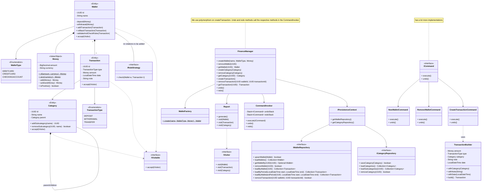

```mermaid
classDiagram
class Wallet{
<<Entity>>
- UUID id
- String name
- deposit(Money)
- withdrawal(Money)
+ addTransaction(Transaction)
+ rollbackTransaction(Transaction)
- validateAndCheckRules(Transaction)
+ accept(Visitor)
}

    class WalletType {
        <<Enumeration>>
        DEBITCARD
        CREDITCARD
        CHECKINGACCOUNT
    }

    class Money {
        <<ValueObject>>
        - BigDecimal amount
        - String currency
        + of(amount, currency) Money $
        + zero(currency) Money $
        ~ add(Money) Money
        ~ subtract(Money) Money
        + isPositive() boolean
    }

    class Transaction {
        <<Entity>>
        - UUID id
        - TransactionType type
        - Money amount
        - LocalDateTime date
        - String note
        + accept(IVisitor)
    }
    
    class TransactionType {
        <<Enumeration>>
        DEPOSIT
        WITHDRAWAL
        TRANSFER
    }

    class Category {
        <<Entity>>
        - UUID id
        - String name
        - Category parent
        + addSubcategory(name) UUID
        + removeSubcategory(UUID, name) boolean
        + accept(IVisitor)
    }

    class IRuleStrategy {
        <<Interface>>
        + check(Wallet w, Transaction t)
    }

    Wallet --> WalletType
    Wallet *-- Money
    Wallet "1" *-- "n" Transaction
    Wallet o-- IRuleStrategy : nn relations to be added
    Wallet ..> IVisitable

    Transaction --> Category
    Transaction --> TransactionType
    Transaction ..> IVisitable

    Category *-- Category : parent/children
    Category ..> IVisitable

    class WalletFactory {
        + create(name, WalletType, Money) Wallet$
    }

    class TransactionBuilder {
        - Money amount
        - TransactionType type
        - Category category
        - String note
        - LocalDateTime date
        + withCategory(Category)
        + withNote(String)
        + withDate(LocalDateTime)
        + build() Transaction
    }

    %% =======================================
    %% Manager
    %% =======================================

    class FinanceManager {
        + createWallet(name, WalletType, Money)
        + removeWallet(UUID)
        + getWallet(UUID) Wallet
        + createCategory(Category)
        + removeCategory(Category)
        + getCategory(UUID) Category
        + createTransaction()
        + removeTransaction(UUID walletId, UUID transactionId)
        + getTransaction(UUID) Transaction
        + undo()
        + redo()
    }

    note for FinanceManager "We use polymorphism on createTransaction. Undo and redo methods call the respective methods in the CommandInvoker"

    FinanceManager --> WalletFactory
    FinanceManager --> Report
    FinanceManager --> CommandInvoker
    FinanceManager --> IPersistenceContext
    
    %% =======================================
    %% Persistence
    %% =======================================

    class IPersistenceContext{
        + getWalletRepository()
        + getCategoryRepository()
    }

    class IWalletRepository{
        <<Interface>>
        + upsertWallet(Wallet) boolean
        + loadWallets() Collection~Wallet~
        + getWalletByUUID(UUID) Optional~Wallet~
        + removeWallet(UUID) boolean
        + loadByWallet(UUID) Collection~Transaction~
        + loadByPeriod(LocalDateTime start, LocalDateTime end) Collection~Transaction~
        + loadByWalletandPeriod(UUID, LocalDateTime start, LocalDateTime end) Collection~Transaction~
        + removeTransaction(UUID walletId, UUID transactionId) boolean
    }

    class ICategoryRepository{
        <<Interface>>
        + saveCategory(Category) boolean
        + loadCategories() Collection~Category~
        + loadSubcategories(UUID) Collection~Category~
        + removeCategory(UUID) boolean
    }

    IPersistenceContext --> IWalletRepository
    IPersistenceContext --> ICategoryRepository

    %% =======================================
    %% Command
    %% =======================================

    class CommandInvoker{
        - Stack~ICommand~ undoStack
        - Stack~ICommand~ redoStack
        + execute(ICommand)
        + undo()
        + redo()
    }

    class ICommand{
        <<Interface>>
        + execute()
        + undo()
    }

    class NewWalletCommand{
        + execute()
        + undo()
    }

    class RemoveWalletCommand{
        + execute()
        + undo()
    }

    class CreateTransactionCommand{
        + execute()
        + undo()
    }

    ICommand --> NewWalletCommand
    ICommand --> RemoveWalletCommand
    ICommand --> CreateTransactionCommand

    CreateTransactionCommand ..> TransactionBuilder : uses
    note for ICommand "has a lot more implementations"

    %% =======================================
    %% Visitor
    %% =======================================

    class IVisitor {
        <<Interface>>
        + visit(Wallet)
        + visit(Transaction)
        + visit(Category)
    }

    class IVisitable {
        <<Interface>>
        + accept(IVisitor)
    }

    class Report{
        + generate()
        + visit(Wallet)
        + visit(Transaction)
        + visit(Category)
    }

    Report ..> IVisitor
```